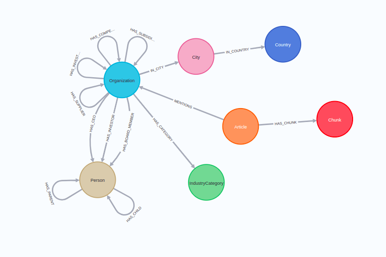

# Project NaLLM

Welcome to the NaLLM project repository, where we are exploring and demonstrating the synergies between Neo4j and Large Language Models (LLMs). As a part of our ongoing project, we are focusing on three primary use cases - a **Natural Language Interface to a Knowledge Graph**, **Creating a Knowledge Graph from Unstructured Data** and **Generate a Report using both static data and data from LLM**.

This repository houses both backend and frontend code, designed and organized to facilitate an intuitive journey through our project.

# Blog posts

During this project we're also writing blog posts where we deep dive into our learnings and explorations.

1. https://medium.com/neo4j/harnessing-large-language-models-with-neo4j-306ccbdd2867
2. https://medium.com/neo4j/knowledge-graphs-llms-fine-tuning-vs-retrieval-augmented-generation-30e875d63a35
3. https://medium.com/neo4j/knowledge-graphs-llms-multi-hop-question-answering-322113f53f51
4. https://medium.com/neo4j/knowledge-graphs-llms-real-time-graph-analytics-89b392eaaa95
5. https://medium.com/neo4j/construct-knowledge-graphs-from-unstructured-text-877be33300a2
   
## Repository Structure

Our repository is designed with an efficient and logical structure for ease of navigation:

- **Backend Code**: The backend code is found in the api folder in the main.py file you can find all endpoints and their corresponding functions. All LLM functionality is split into different components which have thier own purpose.

- **Frontend Code**: The frontend code is organized into two folders - one for each use case these can be found in ui/src. Each folder contains separate React applications that are independent from each other.

## Running the Demos

To simplify the process of running the demos, we have incorporated scripts that generate Docker images. To use these, you'll need to:

1. Navigate into the root directory.
2. Create an env file. You can use the env.example file as a template. (The open API key is optional and can be provided from the UI instead)
3. run `docker-compose up` to build the images.

This will start the backend and frontend servers, and you can access the demos at the following URLs:

- user interface: http://localhost:4173/

- backend: localhost:7860

Please note that you'll need Docker installed on your machine to build and run these images. If you haven't already, you can download Docker from [here](https://www.docker.com/products/docker-desktop).

## Demo database

There is a demo databasing running on demo.neo4jlabs.com. This database is a set of compnaies, thier subsidaiers, people related to the companies and articles mentioned the compnaies. The database is a subset of the [Diffbot](https://www.diffbot.com/) knowledge graph. You can access it with the following credentaiils:

```
URI: neo4j+s://demo.neo4jlabs.com
username: companies
password: companies
database: companies
```



The database contains both structured information about organizations and people as well as news articles.
The news articles are linked to the mentioned entity, while the actual text is stored in the `Chunk` nodes alongside their _text-embedding-ada-002_ vector representations.

## Bring your own database

To run the project on your own database, follow these two steps:

1. Set appropriate database credentials in `.env` file
2. Remove or set appropriate Cypher examples in `api/fewshot_examples.py` file 

## Contributing

We welcome contributions and feedback to improve our project and demonstrations. Please feel free to raise issues or submit pull requests.

## Note

We want to emphasize that the field of AI and specifically LLMs is rapidly evolving. As such, the information, assumptions, and code contained within this repository are based on our current understanding and are subject to change as new data and technological advancements become available.

Thank you for your interest in our project. We hope you find this repository useful and informative. Stay tuned for more updates as we continue to explore the fascinating world of Neo4j and LLMs!
